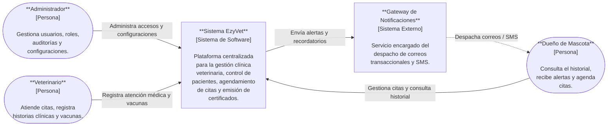
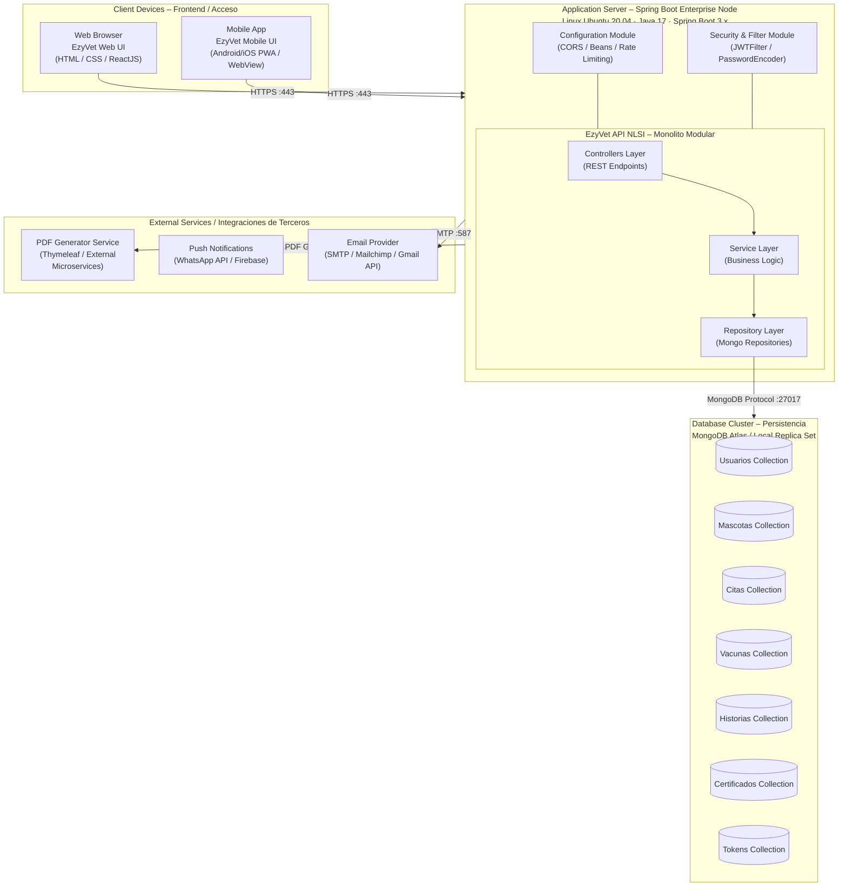
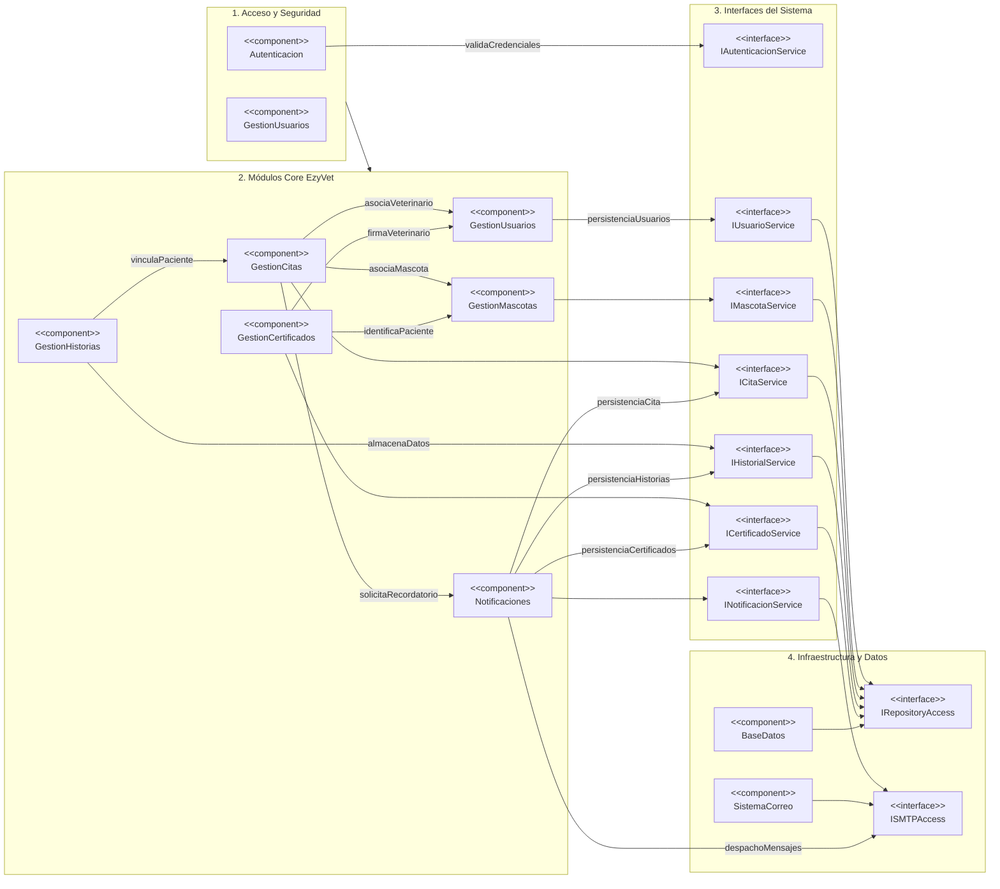
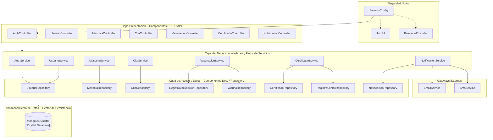
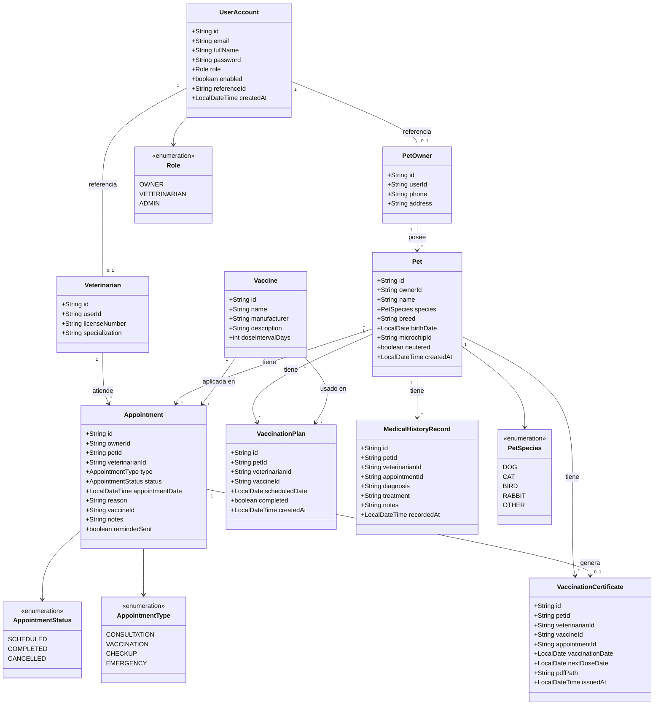

# Ezy vet

Suite completa (backend Spring Boot + frontend React + cliente CLI) para gestionar una clínica veterinaria. Permite registrar dueños y veterinarios, administrar mascotas, agendar/cancelar citas, generar certificados PDF al vacunar, definir planes de vacunación y consumir todo desde un panel visual por rol.

## Contenido
1. [Arquitectura](#arquitectura)
2. [Diagramas](#diagramas)
3. [Requisitos](#requisitos)
4. [Backend](#backend)
5. [Frontend](#frontend)
6. [Cliente CLI](#cliente-cli)
7. [Variables y auto push](#variables-y-auto-push)
8. [Patrones de diseño](#patrones-de-diseño)
9. [Estructura y contribuciones](#estructura-y-contribuciones)

## Arquitectura
- **Backend**: Spring Boot 3.4 (Java 17) + MongoDB. Expone APIs REST para dueños, veterinarios, mascotas, citas, historiales, planes y certificados. Genera certificados en PDF y puede enviar notificaciones/recordatorios configurables.
- **Frontend**: React + Vite. Dos tableros:  
  - Dueño: registra mascotas, ve próximas citas, planes programados y certificados emitidos.  
  - Veterinario: agrega pacientes por ID, agenda y cancela citas, crea planes de vacunación y los marca como completados.
- **CLI**: cliente de consola que interactúa con la misma API para pruebas rápidas.

## Diagramas

### Diagrama de Contexto del Sistema



### Diagrama de Infraestructura / Despliegue



### Diagrama de Componentes



### Diagrama de Arquitectura en Capas



### Diagrama de Clases



## Requisitos
- Java 17+
- Maven 3.9+
- Node.js 20+ / npm 10+
- MongoDB (local o Atlas)

## Backend
1. **Configura variables mínimas**
   ```bash
   export MONGODB_URI=mongodb://localhost:27017/vetcarepro
   export JWT_SECRET=dW5TZWNyZXRvU3VwZXJMYXJnb1NlZ3VybzEyMzQ1Ng==
   ```
2. **Compila y empaqueta**
   ```bash
   mvn clean package -DskipTests
   ```
3. **Ejecuta**
   ```bash
   mvn spring-boot:run
   ```
   El API queda en `http://localhost:8080` (ajusta `SERVER_PORT` si lo necesitas).

### Endpoints destacados
- Autenticación: `POST /auth/login`, `POST /auth/register-owner`, `POST /auth/register-veterinarian`.
- Mascotas/dueños/veterinarios: `GET/POST /api/pets`, `GET /api/owners`, `GET /api/veterinarians`.
- Citas: `GET /api/appointments`, `GET /api/appointments/veterinarian/{id}`, `GET /api/appointments/owner/{id}`, `POST /api/appointments`, `DELETE /api/appointments/{id}`, `POST /api/appointments/{id}/complete`.
- Planes de vacunación: `POST /api/vaccination-plans`, `GET /api/vaccination-plans/pet/{id}`, `GET /api/vaccination-plans/veterinarian/{id}`, `POST /api/vaccination-plans/{id}/complete`, `DELETE /api/vaccination-plans/{id}`.
- Historial y certificados: `/api/medical-history`, `/api/vaccination-certificates/{id}`, `/api/vaccination-certificates/pet/{id}`.

## Frontend
1. Instala dependencias:
   ```bash
   cd frontend
   npm install
   ```
2. Copia `.env.example` a `.env` y ajusta `VITE_API_BASE` si el backend no corre en `http://localhost:8080`.
3. Dev server:
   ```bash
   npm run dev
   ```
   Abre el enlace que imprime Vite (por defecto `http://localhost:5173`).
4. Build producción:
   ```bash
   npm run build
   ```

## Cliente CLI
Ubicado en `src/main/java/com/vetcarepro/cli`. Para probarlo:
```bash
mvn spring-boot:run -Dspring.main.web-application-type=none
```
(o ejecuta `com.ezyvet.cli.TerminalClient` desde tu IDE).

## Variables y auto push
- `MONGODB_URI` y `MONGODB_DB`: conexión a MongoDB.
- `JWT_SECRET` y `JWT_EXPIRATION_MINUTES`: firma y vigencia del token.
- `CERTIFICATE_STORAGE_PATH`: carpeta para PDFs (por defecto `certificates/`).
- `REMINDER_*`: ventanas para recordatorios de citas/vacunas.
- `NOTIFICATION_CHANNELS`: canales permitidos (EMAIL, WHATSAPP, SMS).
- `GIT_AUTO_PUSH_*`: controla el watcher que ejecuta `scripts/auto-push.sh` (desactívalo con `GIT_AUTO_PUSH_ENABLED=false`).

## Patrones de diseño
1. **Builder** – `VaccinationCertificateBuilder` crea certificados consistentes a partir de una cita.
2. **Factory** – `NotificationChannelFactory` resuelve dinámicamente el canal de notificación.
3. **Facade** – `EmailClientFacade` abstrae `JavaMailSender` para el canal de correo.
4. **Singleton (Spring)** – servicios como `PdfGeneratorService` o `VaccinationPlanService` se inyectan una sola vez.

## Estructura y contribuciones
```
├─ src/main/java/com/vetcarepro/      # Backend
├─ src/main/resources/static/         # Panel HTML legacy (referencia)
├─ frontend/                          # Nuevo panel React
├─ scripts/auto-push.sh               # Script usado por el watcher Git
└─ certificates/                      # PDFs generados
```

1. Crea una rama o fork.
2. Ejecuta `mvn clean package` y `npm run build` antes de abrir un PR.
3. Describe claramente el cambio y adjunta evidencia (logs, capturas, etc.).

---
**Demo rápida**:  
`mvn spring-boot:run` → `cd frontend && npm run dev` → abre el navegador y prueba ambos tableros registrando usuarios, mascotas y agendas.
